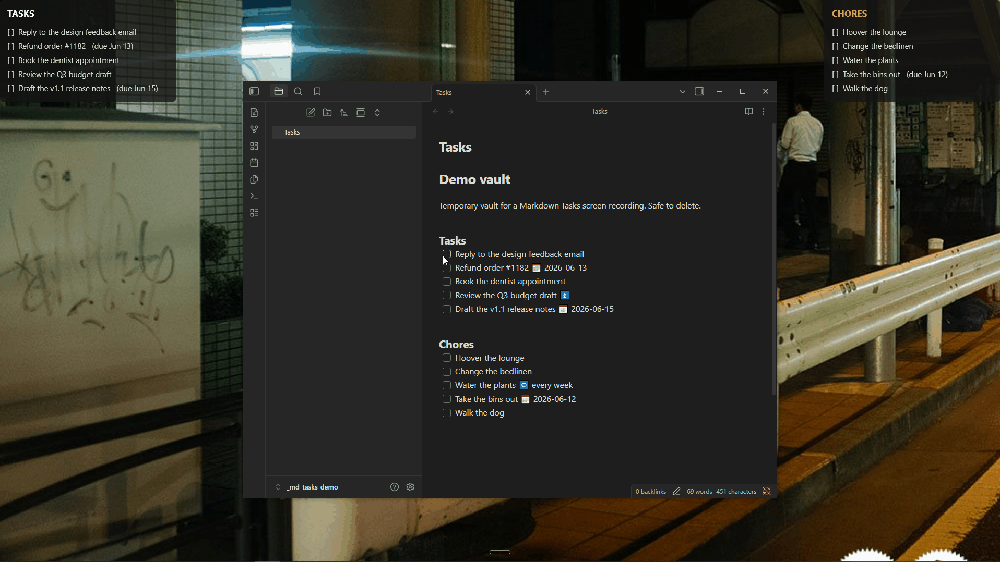

# Markdown Tasks — Rainmeter widgets

Two lightweight [Rainmeter](https://www.rainmeter.net/) widgets that render the open
checkboxes from a Markdown file straight onto your desktop, and let you **click a task to
check it off**. Built for an [Obsidian](https://obsidian.md/) workflow (it understands the
[Tasks plugin](https://publish.obsidian.md/tasks/) due-date syntax), but it works with any
plain Markdown file that uses `- [ ]` checkboxes.



- **Tasks** widget — reads the `### Tasks` section.
- **Chores** widget — reads the `### Chores` section (amber title, otherwise identical).

Both read the **same** Markdown file; they just filter to different headings.

## Why

Task apps live behind a lock screen and an icon — out of sight, out of mind. This puts the
list *on the desktop*, behind your windows, where you can't avoid it, and updates within
seconds whenever you edit the underlying Markdown in your editor of choice.

## How it works

- Reads your Markdown file every 10 seconds.
- Shows only **unchecked** items (`- [ ]`, also `+`/`*` bullets and `1.` lists) under the
  configured heading, including anything under its sub-headings. Items inside code blocks
  are ignored. Check one off (in your editor, or by clicking the row) and it disappears
  from the widget.
- Links are shown as their label: `[[Note|Alias]]` → `Alias`, `[text](url)` → `text`.
- Strips Obsidian Tasks metadata for a clean view: a `📅 2026-06-13` due date is shown as
  `(due Jun 13)`; scheduled/start/done/recurring/priority markers are removed.
- **Click a row** to flip its `- [ ]` to `- [x]` directly in the file. Only that one
  checkbox changes — the rest of your file is left alone.
- The panel auto-sizes to the number of tasks, at any display-scaling (DPI) setting.

## Install

### One-click (recommended)
Download the `.rmskin` from the [latest release](../../releases/latest) and double-click it.
Rainmeter's Skin Installer copies both skins into place and loads the Tasks widget.

### Manual
Copy the `Tasks` and `Chores` folders from `Skins/` into your Rainmeter skins folder
(usually `Documents\Rainmeter\Skins\`), then refresh Rainmeter and load each `.ini`.

## Configure

1. **Point it at your file.** In each skin's `.ini`, set `TaskFile` to the full Windows
   path of your Markdown file (back-slashes, no quotes):
   ```ini
   TaskFile=E:\Notes\Weekly.md
   ```
   The skins ship with `TaskFile=CONFIGURE`; until you change it the widget shows
   "Set TaskFile in the .ini".

2. **Add the headings** to that file:
   ```markdown
   ### Tasks
   - [ ] Email the accountant
   - [ ] Refund order 1182 📅 2026-06-13

   ### Chores
   - [ ] Hoover the lounge
   - [ ] Change the bedlinen
   ```

3. **Position it.** Drag each widget where you want it, then right-click →
   *Settings* → *Position* → **On desktop**, and tick *Save position*.

### Options

All tunables live in the `[Variables]` block at the top of each `.ini`:

| Variable     | Meaning                                            | Default        |
|--------------|----------------------------------------------------|----------------|
| `TaskFile`   | Full path to the Markdown file                     | `CONFIGURE`    |
| `Section`    | Heading to read (`Tasks`, `Chores`, … blank = all) | `Tasks`/`Chores` |
| `MaxTasks`   | Max rows shown (capped by `Slots`, see below)      | `15`           |
| `EmptyText`  | Text shown when nothing is open                    | varies         |
| `FontName` / `FontSize` / `FontColor` / `HoverColor` | Typography           | Segoe UI / 11  |
| `BGColor`    | Panel fill `R,G,B,A`                               | `20,20,20,200` |
| `PanelW`     | Panel width (px)                                   | `340`          |
| `PadX` / `GapTop` / `Gap` / `PadBottom` | Padding & row spacing (px)      | `16/14/6/16`   |

`Slots` is the number of row meters defined in the `.ini` (15). To show more than 15 rows
you also have to add `[MeterTaskN]` blocks and point `MeterBG` at the last one.

To make a widget for a different heading, copy one of the folders and change `Section`
and the title text.

## Notes & limits

- **Clicking checks off; it doesn't un-check.** The widget only shows `- [ ]` items, so to
  bring a task back, un-tick it in your editor.
- Recurring chores have no date logic — the intended workflow is to reset the checkboxes at
  a weekly review.
- More than `MaxTasks` open items in a section: the extras aren't shown (they're still in
  the file).
- Clicking flips the checkbox only. Unlike ticking it in Obsidian, it does not add a `✅`
  completion date, and a `🔁` recurring task will not spawn its next occurrence.
- **Emoji are shown in monochrome.** Emoji in a task's description render (tested on
  Rainmeter 4.5.26), but as flat glyphs in the text colour, not in colour. That is a
  limit of Rainmeter's text meter.
- **`TaskFile` must be an ASCII path.** Rainmeter's Lua cannot open a path containing
  non-Latin characters (e.g. a Cyrillic folder or user name); the widget then shows
  "TaskFile path must be ASCII". Workaround: make an ASCII-named junction to the folder
  (`mklink /J C:\Notes "C:\Users\Иван\Documents\Notes"`) and point `TaskFile` at that.
  The file's *contents* can be in any language.
- **Keep the encoding when editing.** The `.lua` and `.ini` files are UTF-16 LE (with BOM),
  which is what Rainmeter needs to display non-Latin text correctly. If your editor saves
  them as UTF-8, non-Latin text (in the widget, or in an `EmptyText` you translate) turns
  into garbage.
- Requires Rainmeter 4.0+ on Windows.

## Credits

The `.rmskin` is built and published automatically on each release with
[`rmskin-action`](https://github.com/2bndy5/rmskin-action) by
[2bndy5](https://github.com/2bndy5) — thanks!

## License

MIT — see [LICENSE](LICENSE).
